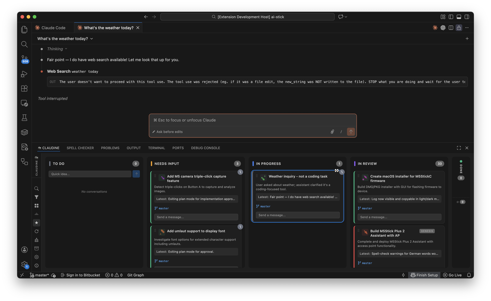

<p align="center">
  
</p>

<h1 align="center">Claudine</h1>

<p align="center">
  <strong>A kanban board for managing Claude Code and OpenAI Codex conversations</strong>
</p>

<p align="center">
  <a href="https://marketplace.visualstudio.com/items?itemName=claudine.claudine"></a>
  <a href="https://marketplace.visualstudio.com/items?itemName=claudine.claudine"></a>
  <a href="https://github.com/salam/claudine/blob/main/LICENSE"></a>
</p>

<p align="center">
  <a href="https://claudine.pro">Website</a> &bull;
  <a href="#installation">Installation</a> &bull;
  <a href="#features">Features</a> &bull;
  <a href="#standalone-mode">Standalone</a> &bull;
  <a href="#configuration">Configuration</a> &bull;
  <a href="#development">Development</a> &bull;
  <a href="#contributing">Contributing</a>
</p>

---

Claudine is a Visual Studio Code extension that gives you a kanban-style overview of all your [Claude Code](https://docs.anthropic.com/en/docs/claude-code) and [OpenAI Codex](https://openai.com/index/codex/) conversations. It reads native JSONL session files, auto-detects status and category, and renders an interactive board directly in VS Code — or as a standalone web app in your browser.



## Features

### Board & Cards

- **Kanban board** — Seven columns: To Do, Needs Input, In Progress, In Review, Done, Cancelled, Archived
- **Auto-status detection** — Conversation state inferred from message content (questions, completions, errors, tool use, text ending with "?")
- **Category classification** — Automatically tagged as Bug, Feature, User Story, Improvement, or Task
- **Category filtering** — Filter the board by category with multi-select chip buttons
- **Drag and drop** — Move conversations between columns; manual overrides preserved until new activity
- **Compact view** — Toggle between full and compact card layouts, individually or globally
- **Resizable columns** — Drag handles between columns to adjust widths; double-click to reset
- **Zoom controls** — Zoom in/out (50%–200%) via toolbar buttons or `Ctrl+=/Ctrl+-/Ctrl+0`
- **Auto-archive** — Done/cancelled conversations automatically archived after 4 hours

### Task Cards

- **Activity timer** — Live counter showing how long the agent has been actively working
- **Agent avatars** — Pulsating badges when Claude is actively working, with active/idle state
- **Sidechain activity dots** — Last 3 subagent steps shown as colored dots (green/yellow/red/gray)
- **Last tool activity** — Shows what the agent is doing right now (e.g. `Read "src/app.ts"`, `Bash "npm test"`)
- **Git branch badge** — Clickable badge linking to Source Control view
- **AI-generated icons** — Optional task icons via OpenAI or Stability AI, with deterministic SVG placeholders
- **Status badges** — Error, interruption, question, and rate-limit indicators
- **Configurable display** — Toggle icon, description, latest message, and git branch visibility per card

### Smart Board (Cross-Project Overview)

- **Actionable overview** — A collapsible section showing only tasks that need attention across all projects
- **Three lanes** — Needs Input, In Progress, In Review
- **Project labels** — Each card shows which project it belongs to
- **Acknowledge & dismiss** — Mark In Review items as seen without changing their status

### Rate Limit Detection & Auto-Restart

- **Automatic detection** — Detects "You've hit your limit" messages in Claude Code output
- **Reset time display** — Amber banner at the top of the board showing when the limit resets
- **Auto-restart** — Optionally sends "continue" to all paused conversations 30 seconds after the limit lifts

### Multi-Provider Support

- **Claude Code** — Watches `~/.claude/projects/**/*.jsonl`
- **OpenAI Codex** — Auto-detects sessions in `~/.codex/sessions/` and displays them alongside Claude Code conversations

### Search

- **Full-text search** — Search across visible card text and full JSONL conversation content
- **Fade / Hide modes** — Toggle between dimming and hiding non-matching cards
- **Matching cards auto-expand** in compact view

### Conversation Actions

- **Click to open** — Open conversations in the Claude Code visual editor
- **Inline prompts** — Send follow-up messages directly from the kanban card
- **Quick ideas** — Multi-line draft area in the To Do column; send drafts as new conversations when ready
- **Conversation focus tracking** — Active Claude Code editor tab highlights the corresponding card

### AI Features

- **Task icon generation** — OpenAI (gpt-image-1) or Stability AI (SDXL), with SVG placeholder fallback
- **Conversation summarization** — AI-powered title and description summaries via local `claude` CLI
- **API key validation** — Test Connection button to verify your API key works

### Agent Integration

- **Board control from agents** — Claude Code agents can move tasks, update titles, and set categories via `.claudine/commands.jsonl`
- **Status bar button** — Shows when `CLAUDINE.AGENTS.md` needs setup or referencing; click to scaffold
- **Extension API** — Other extensions can query conversations, move cards, and listen for changes

### Data Portability

- **Export** — Save your board as CSV, JSON (re-importable), or Trello-compatible JSON
- **Import** — Restore conversations from a Claudine JSON export

### Notifications

- **VS Code notifications** — Desktop alert when a conversation transitions to "Needs Input"
- **Browser notifications** — In standalone mode, browser Notification API alerts for conversations needing input

### Internationalization

- **5 languages** — English, German, French, Spanish, and Italian
- **Full coverage** — Extension metadata, commands, settings, and runtime UI all translated

### Security

- **Content Security Policy** — Strict CSP with per-load nonce for scripts
- **Auth tokens** — Per-session token on all webview↔extension messages
- **Encrypted key storage** — API keys stored via VS Code SecretStorage, never in plaintext settings

## Prerequisites

- [Visual Studio Code](https://code.visualstudio.com/) v1.85.0 or later
- [Claude Code VS Code extension](https://marketplace.visualstudio.com/items?itemName=anthropic.claude-code) installed and configured

## Installation

### From the VS Code Marketplace

1. Open VS Code
2. Go to the Extensions view (`Ctrl+Shift+X` / `Cmd+Shift+X`)
3. Search for **Claudine**
4. Click **Install**

### From VSIX

```bash
code --install-extension claudine-x.y.z.vsix
```

### From source

See [Development](#development) below.

## Standalone Mode

Claudine can also run as a standalone web application outside VS Code. It starts a local server and opens the kanban board in your browser, monitoring all Claude Code and Codex projects on your machine.

### Quick Start

```bash
# Install the CLI globally
npm run build:standalone && npm run build:webview && npm link

# Start the standalone server
claudine standalone
```

The board is served at `http://127.0.0.1:5147` by default.

### CLI

```
claudine <command> [options]

Commands:
  standalone    Start the web server (browser-based board)

Options:
  -v, --version   Show version
  -h, --help      Show help
```

#### `claudine standalone`

```
  -p, --port <number>   Port to listen on (default: 5147)
  --host <address>      Host to bind to (default: 127.0.0.1)
  --no-open             Don't auto-open the browser
  -h, --help            Show this help
```

Examples:

```bash
claudine standalone                     # Default (port 5147, opens browser)
claudine standalone --port 8080         # Custom port
claudine standalone --no-open           # Don't open browser
```

### Development Shortcut

```bash
# Build and run in one step (without global install)
npm run standalone
```

### Standalone-Specific Features

- **Multi-project view** — Conversations grouped by project with collapsible, resizable panes
- **Smart Board** — Cross-project overview of actionable tasks
- **Progressive loading** — Projects discovered instantly, conversations load incrementally with a progress bar
- **Auto-exclude temp directories** — macOS/Windows/Linux system paths excluded from scanning
- **Theme toggle** — Cycle between system, dark, and light themes
- **Desktop notifications** — Browser notifications for conversations needing input

### Standalone Configuration

Standalone mode stores its configuration in `~/.claudine/`:

| File | Purpose |
|------|---------|
| `config.json` | User settings (image API, Claude Code path, UI toggles) |
| `global-state.json` | Board state (column positions, manual overrides) |
| `.secrets.json` | API keys (OpenAI, Stability AI) |
| `storage/` | Persistent data |

## Usage

After installation, Claudine appears as a panel tab (alongside Terminal, Problems, etc.) labeled **Claudine**.

A **Getting Started walkthrough** guides you through initial setup (also available via `Help > Get Started`).

### Sidebar Controls

| Icon | Action |
|------|--------|
| Search | Toggle full-text search |
| Filter | Filter by category (Bug, Feature, etc.) |
| Compact | Toggle compact/expanded card view |
| Expand | Expand or collapse all cards |
| Archive | Show/hide archived conversations |
| Summarize | Toggle AI summarization |
| Refresh | Refresh conversations |
| Zoom +/−/Reset | Board zoom controls |
| Settings | Open settings panel |
| About | About Claudine |

Toolbar location is configurable: **sidebar** (vertical strip, default) or **title bar** (VS Code panel header).

### Card Interactions

- **Click title** — Opens the conversation in the Claude Code editor
- **Drag handle** (dots) — Drag to reorder or move between columns
- **Chevron** — Collapse/expand individual cards
- **Description / Latest** — Click to expand truncated text
- **Git branch** — Click to open Source Control view
- **Respond input** — Appears on cards needing input; type and press Enter to send

### Status Detection

Claudine infers conversation status from message patterns:

| Status | Detection |
|--------|-----------|
| **To Do** | No assistant response yet |
| **Needs Input** | `AskUserQuestion` tool, question patterns, text ending with "?", or recent errors |
| **In Progress** | Last message is from user, or assistant is using tools |
| **In Review** | Assistant indicates completion ("all done", "completed", etc.) |
| **Done** | Manually set via drag-and-drop (preserved until new activity) |
| **Cancelled** | Manually set via drag-and-drop |

## Configuration

Open VS Code Settings (`Ctrl+,` / `Cmd+,`) and search for **Claudine**.

| Setting | Type | Default | Description |
|---------|------|---------|-------------|
| `claudine.claudeCodePath` | `string` | `~/.claude` | Path to the Claude Code data directory |
| `claudine.codexPath` | `string` | `~/.codex` | Path to the OpenAI Codex data directory |
| `claudine.imageGenerationApi` | `string` | `none` | API for task icons: `openai`, `stability`, or `none` |
| `claudine.enableSummarization` | `boolean` | `false` | Generate short summaries for card titles and descriptions |
| `claudine.toolbarLocation` | `string` | `sidebar` | Toolbar placement: `sidebar` or `titlebar` |
| `claudine.autoRestartAfterRateLimit` | `boolean` | `false` | Auto-send "continue" after rate limit resets |
| `claudine.showTaskIcon` | `boolean` | `true` | Show task icon on cards |
| `claudine.showTaskDescription` | `boolean` | `true` | Show description on cards |
| `claudine.showTaskLatest` | `boolean` | `true` | Show last message preview on cards |
| `claudine.showTaskGitBranch` | `boolean` | `true` | Show git branch badge on cards |
| `claudine.monitorWorktrees` | `boolean` | `true` | Also scan Claude Code worktrees found under each monitored workspace at `.claude/worktrees/*` |
| `claudine.monitoredWorkspace` | `object` | `{ mode: 'auto' }` | Monitor the current VS Code workspace, one manual path, or multiple manual paths |

API keys are stored securely via VS Code's `SecretStorage` and configured through the in-app settings panel.

### Icon Generation

When `imageGenerationApi` is set to `openai` or `stability`, Claudine generates a small icon for each conversation card using the conversation's title and description as a prompt.

- **OpenAI** — Uses gpt-image-1 (requires an OpenAI API key)
- **Stability** — Uses Stability AI SDXL (requires a Stability API key)
- **None** — Shows deterministic SVG placeholders with category-colored backgrounds

### Summarization

When enabled, Claudine uses the Claude Code CLI to generate concise titles and descriptions for conversation cards. Summaries are cached and applied non-blocking. Toggle between original and summarized text using the star button in the sidebar.

## Commands

Open the Command Palette (`Ctrl+Shift+P` / `Cmd+Shift+P`) and type "Claudine":

| Command | Keybinding | Description |
| ------- | ---------- | ----------- |
| Open Kanban Board | `Cmd+Shift+K` | Focus the Claudine board |
| Refresh Conversations | `Cmd+Shift+R` | Re-scan JSONL files and update the board |
| Open Conversation... | | Pick a conversation from a list and open it |
| Search Conversations... | `Cmd+Shift+F` | Search text across all JSONL files |
| Start New Conversation... | `Cmd+Shift+N` | Enter a prompt to start a new Claude session |
| Move Conversation to Status... | | Pick a conversation and change its column |
| Show Conversations Needing Input | `Cmd+Shift+I` | Quick filter for conversations waiting on you |
| Show In-Progress Conversations | | Quick filter for currently running conversations |
| Focus Active Claude Tab | `Cmd+Shift+C` | Switch to the first open Claude Code editor |
| Close Empty Claude Tabs | | Clean up restored/duplicate Claude editor tabs |
| Archive Completed Conversations | | Immediately archive all done/cancelled cards |
| Toggle AI Summarization | | Enable or disable AI-generated card summaries |
| Regenerate All Icons | | Clear and regenerate all conversation icons |
| Export Board... | | Save the board as CSV, JSON, or Trello format |
| Import Board... | | Load conversations from a Claudine JSON export |
| Show Diagnostics | | Display extension health info (paths, watcher, counts) |
| Open Settings | | Jump to Claudine settings in VS Code |
| Setup Agent Integration | | Scaffold `CLAUDINE.AGENTS.md` into workspace |
| Toggle Search | | Show/hide the in-board search bar |
| Toggle Filter | | Show/hide the category filter bar |
| Toggle Compact View | | Switch between compact and full card layouts |
| Toggle Expand/Collapse All | | Expand or collapse all cards at once |
| Toggle Archive | | Show/hide the archived conversations column |
| Zoom In | `Cmd+=` | Increase board zoom level |
| Zoom Out | `Cmd+-` | Decrease board zoom level |
| Zoom Reset | `Cmd+0` | Reset board zoom to 100% |
| Toggle Settings Panel | | Open/close the in-board settings panel |
| Toggle About | | Open/close the About dialog |

Keybindings shown are macOS defaults. On Windows/Linux, replace `Cmd` with `Ctrl`.

## Architecture

```
claudine/
├── src/                            # Extension backend (Node.js)
│   ├── extension.ts                # Activation, command registration, service wiring
│   ├── constants.ts                # Named constants (thresholds, delays)
│   ├── providers/
│   │   ├── KanbanViewProvider.ts   # Webview host, message routing, auto-archive
│   │   ├── TabManager.ts          # Claude tab tracking, focus detection
│   │   ├── ClaudeCodeWatcher.ts   # Claude Code file watcher, JSONL search
│   │   ├── ConversationParser.ts  # Claude Code JSONL → Conversation parsing
│   │   ├── CodexWatcher.ts        # OpenAI Codex file watcher
│   │   ├── CodexSessionParser.ts  # Codex JSONL → Conversation parsing
│   │   ├── CompositeConversationProvider.ts  # Multi-provider wrapper
│   │   ├── ClaudeCodeEditorCommands.ts       # claude-vscode command bridge
│   │   └── IConversationProvider.ts          # Provider interface
│   ├── services/
│   │   ├── StateManager.ts        # In-memory state, merge logic, events
│   │   ├── StorageService.ts      # Persistent storage (global + workspace)
│   │   ├── ImageGenerator.ts      # Icon generation (OpenAI / Stability / SVG)
│   │   ├── SummaryService.ts      # AI summarization via Claude CLI
│   │   ├── CategoryClassifier.ts  # Rule-based category detection
│   │   ├── CommandProcessor.ts    # Agent command file watcher
│   │   └── BoardExporter.ts      # CSV / JSON / Trello export & import
│   ├── platform/
│   │   ├── IPlatformAdapter.ts    # Platform abstraction interface
│   │   ├── VsCodeAdapter.ts       # VS Code implementation
│   │   └── StandaloneAdapter.ts   # Node.js/chokidar implementation
│   ├── types/
│   │   └── index.ts               # Shared TypeScript interfaces
│   └── test/                      # Unit tests (vitest, 279 tests)
├── webview/                        # Frontend (Svelte + Vite)
│   └── src/
│       ├── App.svelte              # Root component, toolbar, search, about
│       ├── components/
│       │   ├── KanbanBoard.svelte  # Board layout, DnD, column resizing, drafts
│       │   ├── KanbanColumn.svelte # Column header, active counts
│       │   ├── TaskCard.svelte     # Card rendering, timer, dots, inline prompt
│       │   ├── SmartBoard.svelte   # Cross-project action overview
│       │   ├── ProjectPane.svelte  # Collapsible per-project pane (standalone)
│       │   └── SettingsPanel.svelte# Settings UI
│       ├── stores/
│       │   └── conversations.ts   # Svelte stores, derived search, zoom
│       └── lib/
│           └── vscode.ts          # VS Code webview API bridge
├── standalone/                     # Standalone server (Node.js)
│   ├── cli.ts                     # CLI entry point, arg parsing
│   ├── server.ts                  # HTTP + WebSocket server
│   └── StandaloneMessageHandler.ts # Message routing for standalone
├── resources/
│   ├── icons/                     # Extension icons (PNG + SVG)
│   ├── walkthrough/               # Getting Started walkthrough steps
│   └── CLAUDINE.AGENTS.md        # Template for agent integration
├── l10n/                          # Runtime translation bundles
├── package.nls.json               # English i18n strings
├── package.nls.{de,fr,es,it}.json # Translated i18n strings
└── package.json
```

### Data Flow

```
~/.claude/projects/**/*.jsonl     ~/.codex/sessions/**/*.jsonl
        │                                  │
        ▼                                  ▼
  ClaudeCodeWatcher                  CodexWatcher
        │                                  │
        ▼                                  ▼
  ConversationParser             CodexSessionParser
        │                                  │
        └──────────┬───────────────────────┘
                   ▼
        CompositeConversationProvider
                   │
                   ▼
            StateManager (merge, persist)
                   │
                   ▼
        KanbanViewProvider (postMessage)
                   │
                   ▼
         Svelte Webview (render board)
```

The extension and webview communicate via `postMessage`. All message types are defined in `src/types/index.ts`.

## Development

### Prerequisites

- [Node.js](https://nodejs.org/) 20+
- [npm](https://www.npmjs.com/) 9+

### Setup

```bash
git clone https://github.com/salam/claudine.git
cd claudine
npm install
cd webview && npm install && cd ..
```

### Build

```bash
# Compile extension TypeScript
npm run compile

# Build webview (Svelte → static assets)
npm run build:webview
```

### Watch Mode

```bash
# Terminal 1: Watch extension source
npm run watch

# Terminal 2: Watch webview source
npm run dev:webview
```

### Test

```bash
npm test
```

279 tests across 20 test files (vitest).

### Debug

1. Open the project in VS Code
2. Press `F5` to launch the Extension Development Host
3. The Claudine panel appears in the bottom panel area
4. Changes to the extension require restarting the debug session
5. Changes to the webview require rebuilding (`npm run build:webview`) and reloading the webview

### Lint

```bash
npm run lint
```

### Package

```bash
npx @vscode/vsce package
```

This produces a `.vsix` file you can install or distribute.

## How It Works

Claudine reads Claude Code's native conversation files stored at `~/.claude/projects/<encoded-workspace-path>/*.jsonl`. Each file is a newline-delimited JSON log of a single conversation session, containing user messages, assistant responses, tool calls, and metadata.

The `ConversationParser` extracts:
- **Title** — First user message (cleaned of markup tags)
- **Description** — First assistant response paragraph
- **Last message** — Most recent assistant text
- **Status** — Inferred from message patterns and tool usage
- **Category** — Classified by keyword analysis of title and content
- **Agents** — Detected from `Task` tool invocations (subagents)
- **Git branch** — From entry metadata or message content
- **Error state** — From API errors or tool failures in the latest exchange
- **Sidechain steps** — From subagent tool calls (`isSidechain: true`)
- **Last tool activity** — Most recent tool call name and arguments

Parsing is incremental — on file changes, only newly appended bytes are read and parsed, with previous results cached in an LRU cache (200 entries max).

The `StateManager` merges parsed data with saved state, preserving manual overrides (like marking a conversation as "Done") until new activity is detected.

For OpenAI Codex, the `CodexSessionParser` reads sessions from the date-tree layout (`~/.codex/sessions/YYYY/MM/DD/*.jsonl`) and maps Codex event types to Claudine statuses.

## Contributing

Contributions are welcome! See [CONTRIBUTING.md](CONTRIBUTING.md) for development setup, project structure, coding guidelines, and the pull request process.

For security issues, please see [SECURITY.md](SECURITY.md) for responsible disclosure.

Please note that this project follows a [Code of Conduct](CODE_OF_CONDUCT.md).

## License

[MIT](LICENSE)

## Credits

Developed by [@salam](https://github.com/salam) and contributors.

---

<p align="center">
  <a href="https://claudine.pro">claudine.pro</a>
</p>
